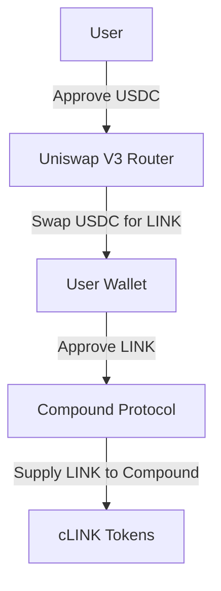

# Token Swap and Compound Supply Script

## Overview

This script facilitates decentralized finance (DeFi) operations by interacting with smart contracts on an EVM-based network. It performs the following functions:

1. **Token Approval:** Approves the token to be swapped (e.g., USDC) by the Uniswap V3 Router contract, allowing it to spend the specified amount on behalf of the user.

2. **Token Swap:** Uses the Uniswap V3 Router to swap approved tokens (e.g., USDC) for another token (e.g., LINK). Retrieves pool information, prepares swap parameters, and executes the swap.

3. **Supply to Compound:** Supplies the acquired tokens (e.g., LINK) to the Compound protocol. Approves Compound to spend LINK tokens and then mints cTokens (representing the user’s supply) within the Compound protocol.

### Interacting Protocols

- **Uniswap V3:** Decentralized exchange protocol used to swap tokens.
- **Compound:** Decentralized lending protocol where users supply and borrow tokens, earning or paying interest.

## Diagram Illustration

Below is a simplified diagram representing the sequence of interactions between the different DeFi protocols:



## How to Use the Script

1. **Set Up Environment:**
   - Ensure Node.js is installed.
   - Create a `.env` file in the root directory of your project with the following variables:
     ```
     RPC_URL=your_rpc_url
     PRIVATE_KEY=your_private_key
     ```

2. **Install Dependencies:**
   Run the following command to install the necessary dependencies:
   ```bash
   npm install ethers dotenv
   ```

3. **Execute the Script:**
   Run the script with:
   ```bash
   node your_script.js
   ```
   Replace `your_script.js` with the actual filename of your script.

4. **Observe Transactions:**
   The script will log transaction hashes to the console. View transaction details on a blockchain explorer (e.g., Etherscan).

## Troubleshooting

If you encounter issues such as undefined transaction hashes or incorrect amounts supplied to Compound, ensure that:

- The environment variables in the `.env` file are correct.
- ABI files for the smart contracts are accurate and up-to-date.
- You are connected to the correct blockchain network and the token addresses are accurate.

## Conclusion

This script demonstrates how to integrate token swaps and lending within the DeFi ecosystem, showcasing interactions with protocols like Uniswap and Compound programmatically.

Certainly! Here’s a detailed explanation of the code for the `Token Swap and Compound Supply Script`, highlighting key functions, logic, and interactions with the DeFi protocols:

---

## Code Explanation

### 1. **Imports and Configuration**

```javascript
const { ethers } = require('ethers');
require('dotenv').config();
```

- **ethers**: The `ethers.js` library is used to interact with the Ethereum blockchain and smart contracts.
- **dotenv**: Loads environment variables from a `.env` file into `process.env`.

### 2. **Environment Variables**

```javascript
const provider = new ethers.providers.JsonRpcProvider(process.env.RPC_URL);
const wallet = new ethers.Wallet(process.env.PRIVATE_KEY, provider);
```

- **provider**: Initializes an Ethereum JSON RPC provider with the URL from the `.env` file.
- **wallet**: Creates an Ethereum wallet instance using the private key and attaches it to the provider.

### 3. **Contract Addresses and ABI**

```javascript
const uniswapV3RouterAddress = '0xUniswapV3RouterAddress';
const compoundAddress = '0xCompoundAddress';
const usdcAddress = '0xUSDCAddress';
const linkAddress = '0xLINKAddress';

const uniswapV3RouterABI = [...]; // ABI for Uniswap V3 Router
const compoundABI = [...];        // ABI for Compound
const erc20ABI = [...];           // ABI for ERC20 tokens
```

- **Addresses**: Placeholder addresses for Uniswap V3 Router, Compound, USDC, and LINK tokens. Replace these with actual contract addresses.
- **ABIs**: Application Binary Interfaces (ABIs) define how to interact with the smart contracts. 

### 4. **Contract Instances**

```javascript
const uniswapV3Router = new ethers.Contract(uniswapV3RouterAddress, uniswapV3RouterABI, wallet);
const compound = new ethers.Contract(compoundAddress, compoundABI, wallet);
const usdc = new ethers.Contract(usdcAddress, erc20ABI, wallet);
const link = new ethers.Contract(linkAddress, erc20ABI, wallet);
```

- **Contract Instances**: Creates instances of the Uniswap V3 Router, Compound, USDC, and LINK contracts using their addresses, ABIs, and wallet.

### 5. **Token Approval Function**

```javascript
async function approveToken(token, spender, amount) {
    const tx = await token.approve(spender, amount);
    await tx.wait();
}
```

- **approveToken**: Approves a specified spender (e.g., Uniswap V3 Router or Compound) to spend a certain amount of the given token on behalf of the user. Waits for the transaction to be mined.

### 6. **Token Swap Function**

```javascript
async function swapToken(amountIn, path) {
    const tx = await uniswapV3Router.swapExactTokensForTokens(
        amountIn,
        0, // Amount out is set to 0 for simplicity; adjust based on slippage tolerance
        path,
        wallet.address,
        Math.floor(Date.now() / 1000) + 60 * 10 // Deadline (10 minutes from now)
    );
    await tx.wait();
}
```

- **swapToken**: Performs a token swap using Uniswap V3 Router. 
  - **amountIn**: The amount of the input token to swap.
  - **path**: The path for the swap, e.g., `[USDC_ADDRESS, LINK_ADDRESS]`.
  - **Deadline**: The transaction deadline, set to 10 minutes from now.

### 7. **Supply to Compound Function**

```javascript
async function supplyToCompound(amount) {
    await approveToken(link, compoundAddress, amount);
    const tx = await compound.mint(amount);
    await tx.wait();
}
```

- **supplyToCompound**: Supplies tokens to the Compound protocol.
  - **approveToken**: First, approve Compound to spend the LINK tokens.
  - **compound.mint**: Mints cLINK tokens by supplying LINK tokens to Compound.

### 8. **Main Execution Function**

```javascript
async function main() {
    const amountToSwap = ethers.utils.parseUnits('100', 6); // 100 USDC (assuming 6 decimal places)
    const amountToSupply = ethers.utils.parseUnits('100', 18); // 100 LINK (assuming 18 decimal places)
    const path = [usdcAddress, linkAddress];

    // Approve USDC for Uniswap Router
    await approveToken(usdc, uniswapV3RouterAddress, amountToSwap);

    // Swap USDC for LINK
    await swapToken(amountToSwap, path);

    // Approve LINK for Compound
    await approveToken(link, compoundAddress, amountToSupply);

    // Supply LINK to Compound
    await supplyToCompound(amountToSupply);
}

main().catch(console.error);
```

- **main**: The main function that orchestrates the entire process.
  - **amountToSwap**: Defines the amount of USDC to swap.
  - **amountToSupply**: Defines the amount of LINK to supply to Compound.
  - **path**: Specifies the token swap path.
  - Calls `approveToken`, `swapToken`, and `supplyToCompound` functions in sequence to execute the DeFi operations.

### Summary

- **Token Approval**: Allows the Uniswap Router and Compound to spend tokens on behalf of the user.
- **Token Swap**: Uses Uniswap V3 to swap tokens.
- **Supply to Compound**: Supplies the swapped tokens to Compound, earning interest in the form of cTokens.

This detailed breakdown should help you understand how the script interacts with the DeFi protocols and how each part of the code contributes to the overall functionality.